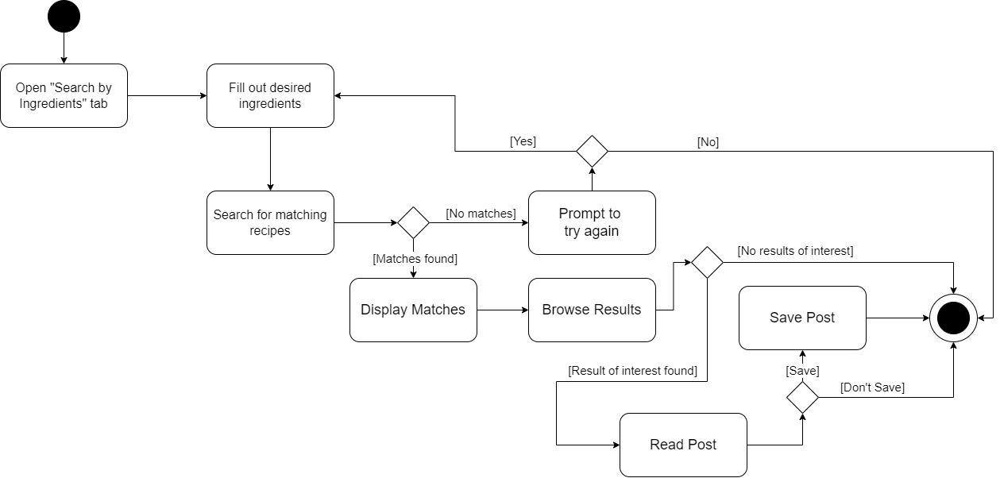
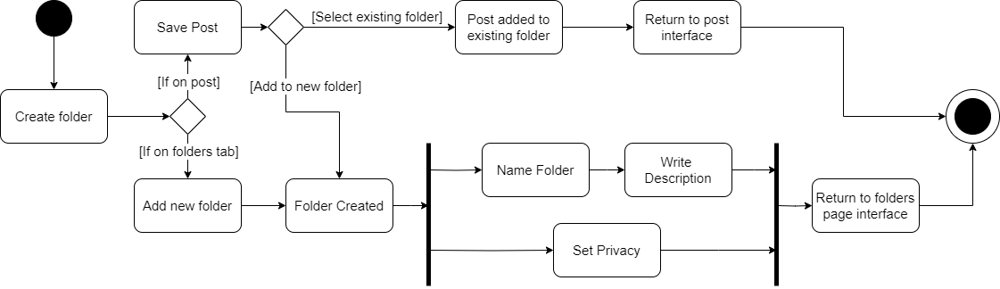

# Specification Phase Exercise

A little exercise to get started with the specification phase of the software development lifecycle. See the [instructions](instructions.md) for more detail.

## Team members

Safia Billah https://github.com/safiabillah  
Kevin Chan https://github.com/naruminato1  
Simon Sherbet https://github.com/simesherbs  
Sean Mo https://github.com/bairixie  
Dylan Martin https://github.com/dm6288  

## Stakeholders

Stakeholder 1: Caryn, S. -- Advanced level baker/cook who used to run an online bakery business through Instagram.

    Goals:
        1. Find recipes based on what they already (mostly) have in the fridge.
        2. Concise communication of recipe -- instructions and notes clearly represented with little bloat
        3. Focused on pictures and videos. Want to *see* what friends made and/or shared, not simply read it.
        4. Create folders to group recipes, in case they want to prepare for a multi-course meal.
        5. Be able to link account to other social media.
        6. Convert older handwritten recipes to digital without having to type it all by hand.

    Frustrations:
        1. Recipes only having volume measurements (cups, tablespoons, etc), but not mass measurements.
        2. Paragraphs of backstory with recipe at the very end.
        3. Lacking search features. Said that it can be tricky to find a recipe based on characteristics (flavor profile, country of origin, etc). Often times need to already have a dish in mind.
        4. Other social media sites aren't formatted for easily reading or writing out recipes, often times resigned to writing them out in the description box of a picture or video post which is not ideal.

Stakeholder 2: Lilly, S. -- Beginner level baker/cook

    Goals:
        1. Want to see what friends are cooking/creating. More interested in a 'following' tab than a 'for you' tab.
        2. Be able to compliment in comment on friends recipes/posts.
        3. Create folders for different recipes.
        4. Ask for suggestions from friends on what could be improved in a recipe.

    Frustrations:
        1. Recipe sites that lead with several paragraphs of back story before getting to the recipe.
        2a. Recipes not being up-front about more specialized equipment (stand mixer, blender, etc)
        2b. Not being able to search by required equipment.
        3. Ads make many dedicated recipe websites actively aggravating to use. Overall experience is cluttered and clunky.
        4. Difficult to get a sense of what a recipe may cost until she's already at the grocery store checkout.

## Product Vision Statement

A recipe creation and sharing app that allows users to enagage with friends while making use of robust search features to find the perfect recipe for any dish.

## User Requirements

1. As a user, I want to find recipes based on the ingredients I already have so that I can avoid unnecessary grocery shopping.

2. As a beginner cook, I want to see short tutorial videos or pictures for each step of the recipe so that I can improve my cooking skills.

3. As a beginner cook, I want to search for recipes using ingredient weights in grams so that I can measure more accurately.

4. As a busy professional, I want the recipe to be presented upfront without long backstories so that I can start cooking immediately.

5. As a user, I want to know upfront what equipment is required for a recipe so that I can ensure I have everything I need before starting.

6. As a user, I want to filter recipes by dietary restrictions (e.g., gluten-free, vegan) so that I can find meals that fit my preferences.

7. As a curious cook, I want to explore new cuisines by searching recipes based on their cultural origin so that I can broaden my cooking repertoire.

8. As a health-conscious user, I want to filter recipes by nutritional values so that I can make informed decisions about what I’m eating.

9. As a user, I want to save my favorite recipes in a personalized folder so that I can quickly access them for future use.

10. As a user, I want to share recipes with friends and family via social media or messaging apps so that I can inspire others with my cooking.

11. As a busy parent, I want to find family-friendly recipes that can be made in large portions so that I can cook for everyone at once.

12. As a user, I want to create custom folders for different courses or occasions so that I can organize and plan multi-course meals easily.

13. As a user, I want to search for recipes based on specific characteristics like “comfort food” or “light meals” so that I can match the dish to my mood or event.

14. As a user, I want to search for a specific food I already have in mind so that I can quickly find a recipe to make that dish without browsing through unrelated options.

15. As a user, I want to filter recipes by preparation time so that I can quickly find dishes that fit my available time.

16. As a user, I want to scan handwritten recipes to quickly convert them into digital format so that I can store them easily without manually typing them out.

17. As a user, I want to be able to follow my friends’ cooking activities and see what they are creating so that I can be inspired by their recipes and techniques.

18. As a user, I want to comment on friends’ recipes and posts so that I can give feedback, suggestions, or compliments on their cooking.

19. As a user, I want to avoid recipes that have long backstories or excessive ads, so that I can quickly access the instructions and start cooking.

20. As a user, I want the app to suggest improvements or tweaks to my recipes based on feedback from friends so that I can continuously improve my cooking.

21. As a user, I want to see an estimated cost of the recipe ingredients so that I can better plan my meals and avoid surprises at the grocery store.

22. As a user, I want to log in securely using my credentials or social media accounts so that I can access my saved recipes, preferences, and shared content easily across devices.

## Activity Diagrams

1. User Story: **_"As a user, I want to find recipes based on the ingredients I already have so that I can avoid unnecessary grocery shopping."_**
   

2. User Story: **_As a user, I want to create custom folders for different courses or occasions so that I can organize and plan multi-course meals easily._**

## Clickable Prototype

See instructions. Delete this line and place a publicly-accessible link to your clickable prototype here.
